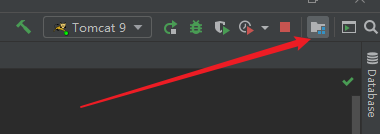
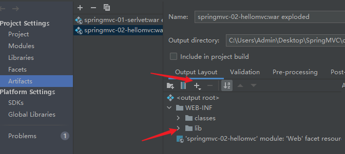
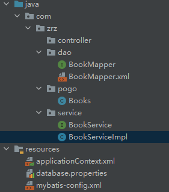
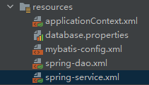

# SpringMVC

ssm：mybatis + Spring + SpringMVC **MVC三层架构**


**MVC**框架要做哪些事情

1. 将url映射到Java类或Java类的方法
2. 封装用户提交的数据
3. 处理请求--调用相关的业务处理--封装相应数据
4. 将响应的数据进行渲染 .jsp/html等表示层数据

**MVC模式**（Model–view–controller）是软件工程中的一种软件架构模式，把软件系统分为三个基本部分：模型（Model）、视图（View）和控制器（Controller）。

- 模型（Model） - 程序员编写程序应有的功能（实现算法等等）、数据库专家进行数据管理和数据库设计(可以实现具体的功能)。
- 视图（View） - 界面设计人员进行图形界面设计。
- 控制器（Controller）- 负责转发请求，对请求进行处理。

SpringMVC是SpringFramework的一部分，是基于Java实现MVC的轻量级Web框架。


# 1、HelloSpringMVC


1. 右键add Framework support

2. porjectsturcture-Artfacts-~-添加lib文件夹-添加Library Files

   



3. web-WEB-INF内添加jsp文件夹，里面放网页jsp文件

4. resources文件夹下配置文件springmvc-servlet.xml

   ```xml
   <?xml version="1.0" encoding="UTF-8"?>
   <beans xmlns="http://www.springframework.org/schema/beans"
          xmlns:xsi="http://www.w3.org/2001/XMLSchema-instance"
          xsi:schemaLocation="http://www.springframework.org/schema/beans
          http://www.springframework.org/schema/beans/spring-beans.xsd">
   
       <!--处理器映射器-->
       <bean class="org.springframework.web.servlet.handler.BeanNameUrlHandlerMapping"/>
       <!--处理器适配器-->
       <bean class="org.springframework.web.servlet.mvc.SimpleControllerHandlerAdapter"/>
       <!--视图解析器:模板引擎Thymeleaf Freemaker...-->
       <bean class="org.springframework.web.servlet.view.InternalResourceViewResolver" id="InternalResourceViewResolver">
           <!--前缀-->
           <property name="prefix" value="/WEB-INF/jsp/"/>
           <!--后缀-->
           <property name="suffix" value=".jsp"/>
       </bean>
       
       <!--BeanNameUrlHandlerMapping:bean-->
       <bean id="/hello" class="com.zrz.controller.HelloController"/>
   </beans>
   ```

   

5. 配置web.xml

   ```xml
   <?xml version="1.0" encoding="UTF-8"?>
   <web-app xmlns="http://xmlns.jcp.org/xml/ns/javaee"
            xmlns:xsi="http://www.w3.org/2001/XMLSchema-instance"
            xsi:schemaLocation="http://xmlns.jcp.org/xml/ns/javaee http://xmlns.jcp.org/xml/ns/javaee/web-app_4_0.xsd"
            version="4.0">
   
       <!--配置DispatchServlet:这个是SpringMVC的核心：请求分发器，前端控制器-->
       <servlet>
           <servlet-name>springmvc</servlet-name>
           <servlet-class>org.springframework.web.servlet.DispatcherServlet</servlet-class>
           <!--DispatcherServlet要绑定Spring的配置文件-->
           <init-param>
               <param-name>contextConfigLocation</param-name>
               <param-value>classpath:springmvc-servlet.xml</param-value>
           </init-param>
           <!--启动级别：1-->
           <load-on-startup>1</load-on-startup>
       </servlet>
       <!--
       在SpringMVC中，/  /*
       /:只匹配所有的请求，不会去匹配jsp页面
       /*:匹配所有的请求，包括jsp页面
       -->
       <servlet-mapping>
           <servlet-name>springmvc</servlet-name>
           <url-pattern>/</url-pattern>
       </servlet-mapping>
   
   </web-app>
   ```

6. 写控制层com.zrz.controller

   ```java
   package com.zrz.controller;
   
   import org.springframework.web.servlet.ModelAndView;
   import org.springframework.web.servlet.mvc.Controller;
   import javax.servlet.http.HttpServletRequest;
   import javax.servlet.http.HttpServletResponse;
   
   public class HelloController implements Controller {
       @Override
       public ModelAndView handleRequest(HttpServletRequest httpServletRequest, HttpServletResponse httpServletResponse) throws Exception {
           ModelAndView mv = new ModelAndView();
           //业务代码
           String result = "HelloSpringMVC";
           mv.addObject("msg",result);
           //视图跳转,设置视图名字
           mv.setViewName("test");
           return mv;
       }
   }
   ```

   

# 小结

1. 新建一个web项目
2. 导入相关jar包
3. 编写web.xml，注册DispatcherServlet
4. 编写springmvc配置文件
5. 接下来就是去创建对应的控制类，controller
6. 最后完善前端视图和controller之间的对应
7. 测试允许调试


# 2、注解配置

1. pom.xml配置

2. 配置web.xml

   ```xml
   <?xml version="1.0" encoding="UTF-8"?>
   <web-app xmlns="http://xmlns.jcp.org/xml/ns/javaee"
            xmlns:xsi="http://www.w3.org/2001/XMLSchema-instance"
            xsi:schemaLocation="http://xmlns.jcp.org/xml/ns/javaee http://xmlns.jcp.org/xml/ns/javaee/web-app_4_0.xsd"
            version="4.0">
   
       <!--配置DispatchServlet:这个是SpringMVC的核心：请求分发器，前端控制器-->
       <servlet>
           <servlet-name>springmvc</servlet-name>
           <servlet-class>org.springframework.web.servlet.DispatcherServlet</servlet-class>
           <!--DispatcherServlet要绑定Spring的配置文件-->
           <init-param>
               <param-name>contextConfigLocation</param-name>
               <param-value>classpath:springmvc-servlet.xml</param-value>
           </init-param>
           <!--启动级别：1-->
           <load-on-startup>1</load-on-startup>
       </servlet>
       <!--
       在SpringMVC中，/  /*
       /:只匹配所有的请求，不会去匹配jsp页面
       /*:匹配所有的请求，包括jsp页面
       -->
       <servlet-mapping>
           <servlet-name>springmvc</servlet-name>
           <url-pattern>/</url-pattern>
       </servlet-mapping>
   
   </web-app>
   ```

3. 配置springmvc-servlet.xml

   ```xml
   <?xml version="1.0" encoding="UTF-8"?>
   <beans xmlns="http://www.springframework.org/schema/beans"
          xmlns:xsi="http://www.w3.org/2001/XMLSchema-instance"
          xmlns:context="http://www.springframework.org/schema/context"
          xmlns:mvc="http://www.springframework.org/schema/mvc"
          xsi:schemaLocation="http://www.springframework.org/schema/beans http://www.springframework.org/schema/beans/spring-beans.xsd
           http://www.springframework.org/schema/context http://www.springframework.org/schema/context/spring-context-4.1.xsd
           http://www.springframework.org/schema/mvc http://www.springframework.org/schema/mvc/spring-mvc-4.1.xsd">
   
       <!-- scan the package and the sub package -->
       <context:component-scan base-package="com.zrz.controller"/>
   
       <!-- don't handle the static resource -->
       <mvc:default-servlet-handler />
   
       <!-- if you use annotation you must configure following setting -->
       <mvc:annotation-driven />
   
       <!-- configure the InternalResourceViewResolver -->
       <bean class="org.springframework.web.servlet.view.InternalResourceViewResolver"
             id="internalResourceViewResolver">
           <!-- 前缀 -->
           <property name="prefix" value="/WEB-INF/jsp/" />
           <!-- 后缀 -->
           <property name="suffix" value=".jsp" />
       </bean>
   </beans>
   ```

4. controller

   ```java
   package com.zrz.controller;
   
   import org.springframework.stereotype.Controller;
   import org.springframework.ui.Model;
   import org.springframework.web.bind.annotation.RequestMapping;
   
   @Controller
   public class HelloController{
   
       @RequestMapping("/hello")
       public String hello(Model model){
           //封装数据
           model.addAttribute("msg","Hello,SpringMVCAnnotation");
           return "hello"; //会被视图解析器处理
       }
   
   }
   ```

5. jsp

   ```xml
   <%@ page contentType="text/html;charset=UTF-8" language="java" %>
   <html>
   <head>
       <title>Title</title>
   </head>
   <body>
   ${msg}
   </body>
   </html>
   ```


# SSM整合

## 1，配置

### a,配置依赖、静态资源导出

```xml
<?xml version="1.0" encoding="UTF-8"?>
<project xmlns="http://maven.apache.org/POM/4.0.0"
         xmlns:xsi="http://www.w3.org/2001/XMLSchema-instance"
         xsi:schemaLocation="http://maven.apache.org/POM/4.0.0 http://maven.apache.org/xsd/maven-4.0.0.xsd">
    <modelVersion>4.0.0</modelVersion>

    <groupId>com.zrz</groupId>
    <artifactId>ssmbuild</artifactId>
    <version>1.0-SNAPSHOT</version>

    <properties>
        <maven.compiler.source>8</maven.compiler.source>
        <maven.compiler.target>8</maven.compiler.target>
    </properties>

    <!--依赖：junit，数据库驱动，连接池，servlet，jsp，mybatis，mybatis-spring，spring-->
    <dependencies>
        <dependency>
            <!--junit-->
            <groupId>junit</groupId>
            <artifactId>junit</artifactId>
            <version>4.12</version>
        </dependency>
        <dependency>
            <!--数据库驱动-->
            <groupId>mysql</groupId>
            <artifactId>mysql-connector-java</artifactId>
            <version>5.1.47</version>
        </dependency>
        <dependency>
            <!--数据库连接池：c3p0 dbcp-->
            <groupId>com.mchange</groupId>
            <artifactId>c3p0</artifactId>
            <version>0.9.5.2</version>
        </dependency>
        <!--Servlet - JSP-->
        <dependency>
            <groupId>javax.servlet</groupId>
            <artifactId>servlet-api</artifactId>
            <version>2.5</version>
        </dependency>
        <dependency>
            <groupId>javax.servlet.jsp</groupId>
            <artifactId>jsp-api</artifactId>
            <version>2.2</version>
        </dependency>
        <dependency>
            <groupId>javax.servlet</groupId>
            <artifactId>jstl</artifactId>
            <version>1.2</version>
        </dependency>
        <!--Mybatis-->
        <dependency>
            <groupId>org.mybatis</groupId>
            <artifactId>mybatis</artifactId>
            <version>3.5.2</version>
        </dependency>
        <dependency>
            <groupId>org.mybatis</groupId>
            <artifactId>mybatis-spring</artifactId>
            <version>2.0.6</version>
        </dependency>
        <!--Spring-->
        <dependency>
            <groupId>org.springframework</groupId>
            <artifactId>spring-webmvc</artifactId>
            <version>5.3.7</version>
        </dependency>
        <dependency>
            <groupId>org.springframework</groupId>
            <artifactId>spring-jdbc</artifactId>
            <version>5.1.19.RELEASE</version>
        </dependency>
    </dependencies>

    <!--静态资源导出问题-->
    <build>
        <resources>
            <resource>
                <directory>src/main/java</directory>
                <includes>
                    <include>**/*.properties</include>
                    <include>**/*.xml</include>
                </includes>
                <filtering>false</filtering>
            </resource>
            <resource>
                <directory>src/main/resources</directory>
                <includes>
                    <include>**/*.properties</include>
                    <include>**/*.xml</include>
                </includes>
                <filtering>false</filtering>
            </resource>
        </resources>
    </build>

</project>
```

### b,Mybatis、Spring核心配置文件

**mybatis核心配置文件**

```xml
<?xml version="1.0" encoding="UTF-8" ?>
<!DOCTYPE configuration
        PUBLIC "-//mybatis.org//DTD Config 3.0//EN"
        "http://mybatis.org/dtd/mybatis-3-config.dtd">
<configuration>

    <!--配置数据源，交给Spring去做-->

    <typeAliases>
        <package name="com.zrz.pogo"/>
    </typeAliases>
    
</configuration>
```

**spring核心配置文件**

```xml
<?xml version="1.0" encoding="UTF-8"?>
<beans xmlns="http://www.springframework.org/schema/beans"
       xmlns:xsi="http://www.w3.org/2001/XMLSchema-instance"
       xsi:schemaLocation="http://www.springframework.org/schema/beans
        http://www.springframework.org/schema/beans/spring-beans.xsd">

</beans>
```

## 2，Mybatis层



### a，构造对象Books

```java
package com.zrz.pogo;

import lombok.AllArgsConstructor;
import lombok.Data;
import lombok.NoArgsConstructor;

@Data
@AllArgsConstructor
@NoArgsConstructor
public class Books {
    private int bookID;
    private String bookName;
    private int bookCounts;
    private String detail;
    
}
```

### b，构造相应动作的接口BookMapper

```java
package com.zrz.dao;

import com.zrz.pogo.Books;
import org.apache.ibatis.annotations.Param;

import java.util.List;

public interface BookMapper {
    //增加一本书
    int addBook(Books books);
    //删除一本书
    int deleteBookById(@Param("bookId")int id);
    //更新一本书
    int updateBook(Books books);

    //查询一本书
    Books queryBookById(int id);
    //查询全部的书
    List<Books> queryAllBook();

}
```

### c,对接口中的方法进行配置BookMapper.xml

```xml
<?xml version="1.0" encoding="UTF-8" ?>
<!DOCTYPE mapper
        PUBLIC "-//mybatis.org//DTD Config 3.0//EN"
        "http://mybatis.org/dtd/mybatis-3-mapper.dtd">
<mapper namespace="com.zrz.dao.BookMapper">
    <insert id="addBook" parameterType="Books">
        insert into ssmbuild.books (bookName,bookCounts,detail)
        values(#{bookName},#{bookCounts},#{detail});
    </insert>

    <delete id="deleteBookById" parameterType="int">
        delete from ssmbuild.books where bookID = #{bookId};
    </delete>

    <update id="updateBook" parameterType="Books">
        update ssmbuild.books
        set bookName = #{bookName},bookCounts=#{bookCounts},detail=#{detail}
        where bookId=#{bookID};
    </update>

    <select id="queryBookById" resultType="Books">
        select * from ssmbuild.books
        from bookID = #{bookId};
    </select>
    
    <select id="queryAllBook" resultType="Books">
        select * from ssmbuild.books;
    </select>
</mapper>
```

### d,配置mybatis核心配置文件mybatis-config

```xml
<mappers>
    <mapper class="com.zrz.dao.BookMapper"/>
</mappers>
```

### e，服务层接口BookService

```java
package com.zrz.service;

import com.zrz.pogo.Books;
import org.apache.ibatis.annotations.Param;

import java.util.List;

public interface BookService {
    //增加一本书
    int addBook(Books books);
    //删除一本书
    int deleteBookById(int id);
    //更新一本书
    int updateBook(Books books);

    //查询一本书
    Books queryBookById(int id);
    //查询全部的书
    List<Books> queryAllBook();
}
```

### f，服务层实现类BookServiceImpl

```java
package com.zrz.service;

import com.zrz.dao.BookMapper;
import com.zrz.pogo.Books;

import java.util.List;

public class BookServiceImpl implements BookService{

    //service调dao层：组合Dao
    private BookMapper bookMapper;

    public void setBookMapper(BookMapper bookMapper) {
        this.bookMapper = bookMapper;
    }

    @Override
    public int addBook(Books books) {
        return bookMapper.addBook(books);
    }

    @Override
    public int deleteBookById(int id) {
        return bookMapper.deleteBookById(id);
    }

    @Override
    public int updateBook(Books books) {
        return bookMapper.updateBook(books);
    }

    @Override
    public Books queryBookById(int id) {
        return bookMapper.queryBookById(id);
    }

    @Override
    public List<Books> queryAllBook() {
        return bookMapper.queryAllBook();
    }
}
```

## 3,Spring层



### a，spring整合dao层spring-dao.xml

```xml
<?xml version="1.0" encoding="UTF-8"?>
<beans xmlns="http://www.springframework.org/schema/beans"
       xmlns:xsi="http://www.w3.org/2001/XMLSchema-instance"
       xmlns:context="http://www.springframework.org/schema/context"
       xsi:schemaLocation="http://www.springframework.org/schema/beans
        http://www.springframework.org/schema/beans/spring-beans.xsd http://www.springframework.org/schema/context https://www.springframework.org/schema/context/spring-context.xsd">

    <!--1.关联数据库配置文件-->
    <context:property-placeholder location="classpath:database.properties"/>

    <!--2.连接池
        dbcp：半自动化操作，不能自动连接
        c3p0：自动化操作（自动化加载配置文件，并且可以自动设置到对象中）
        druid、hikari
    -->
    <bean id="dataSource" class="com.mchange.v2.c3p0.ComboPooledDataSource">
        <property name="driverClass" value="${jdbc.driver}"/>
        <property name="jdbcUrl" value="${jdbc.url}"/>
        <property name="user" value="${jdbc.username}"/>
        <property name="password" value="${jdbc.password}"/>

        <!--c3p0连接池的私有属性-->
        <property name="maxPoolSize" value="30"/>
        <property name="minPoolSize" value="10"/>
        <!--关闭连接后不自动commit-->
        <property name="autoCommitOnClose" value="false"/>
        <!--获取连接超时时间-->
        <property name="checkoutTimeout" value="10000"/>
        <!--当获取连接失败重试次数-->
        <property name="acquireRetryAttempts" value="2"/>
    </bean>

    <!--3.sqlSessionFactory-->
    <bean id="sqlSessionFacotry" class="org.mybatis.spring.SqlSessionFactoryBean">
        <property name="dataSource" ref="dataSource"/>
        <!--绑定Mybatis的配置文件-->
        <property name="configLocation" value="classpath:mybatis-config.xml"/>
    </bean>

    <!--配置dao接口扫描包，动态实现了dao接口可以注入到Spring容器中-->
    <bean class="org.mybatis.spring.mapper.MapperScannerConfigurer">
        <!--注入sqlSessionFactory-->
        <property name="sqlSessionFactoryBeanName" value="sqlSessionFactory"/>
        <!--要扫描的dao包-->
        <property name="basePackage" value="com.zrz.dao"/>
    </bean>

</beans>
```


### b，spring整合service层spring-service.xml

```xml
<?xml version="1.0" encoding="UTF-8"?>
<beans xmlns="http://www.springframework.org/schema/beans"
       xmlns:xsi="http://www.w3.org/2001/XMLSchema-instance"
       xmlns:context="http://www.springframework.org/schema/context"
       xsi:schemaLocation="http://www.springframework.org/schema/beans
        http://www.springframework.org/schema/beans/spring-beans.xsd http://www.springframework.org/schema/context https://www.springframework.org/schema/context/spring-context.xsd">

    <!--1.扫描service下的包-->
    <context:component-scan base-package="com.zrz.service"/>

    <!--2.将我们的所有业务类，注入到spring，可以通过配置或者注解实现-->
    <bean id="BookServiceImpl" class="com.zrz.service.BookServiceImpl">
        <property name="bookMapper" ref="bookMapper"/>
    </bean>

    <!--3.声明式事务-->
    <bean id="transactionManager" class="org.springframework.jdbc.datasource.DataSourceTransactionManager">
       <!--注入数据源-->
        <property name="dataSource" ref="dataSource"/>
    </bean>

    <!--4.aop事务支持-->
</beans>

```

## 4,MVC层

### a，整合spring-mvc.xml

```xml
<?xml version="1.0" encoding="UTF-8"?>
<beans xmlns="http://www.springframework.org/schema/beans"
       xmlns:xsi="http://www.w3.org/2001/XMLSchema-instance" xmlns:mvc="http://www.springframework.org/schema/mvc"
       xmlns:context="http://www.springframework.org/schema/context"
       xsi:schemaLocation="http://www.springframework.org/schema/beans
        http://www.springframework.org/schema/beans/spring-beans.xsd
        http://www.springframework.org/schema/mvc
        https://www.springframework.org/schema/mvc/spring-mvc.xsd
        http://www.springframework.org/schema/context
        https://www.springframework.org/schema/context/spring-context.xsd">

    <!--1,注解驱动-->
    <mvc:annotation-driven/>
    <!--2，静态资源过滤-->
    <mvc:default-servlet-handler/>
    <!--3.扫描包：controller-->
    <context:component-scan base-package="com.zrz.controller"/>
    <!--4，视图解析器-->
    <bean class="org.springframework.web.servlet.view.InternalResourceViewResolver">
        <property name="prefix" value="/WEB-INF/jsp/"/>
        <property name="suffix" value=".jsp"/>
    </bean>

</beans>
```

### b、整合三个xml到applicationContext.xml

```xml
    <import resource="classpath:spring-dao.xml"/>
    <import resource="classpath:spring-mvc.xml"/>
    <import resource="classpath:spring-service.xml"/>
```

### b、添加web支持，配置web.xml

```xml
<?xml version="1.0" encoding="UTF-8"?>
<web-app xmlns="http://xmlns.jcp.org/xml/ns/javaee"
         xmlns:xsi="http://www.w3.org/2001/XMLSchema-instance"
         xsi:schemaLocation="http://xmlns.jcp.org/xml/ns/javaee http://xmlns.jcp.org/xml/ns/javaee/web-app_4_0.xsd"
         version="4.0">

    <!--DiapatchServlet-->
    <servlet>
        <servlet-name>springmvc</servlet-name>
        <servlet-class>org.springframework.web.servlet.DispatcherServlet</servlet-class>
        <init-param>
            <param-name>contextConfigLocation</param-name>
            <param-value>classpath:applicationContext.x</param-value>
        </init-param>
    </servlet>
    <servlet-mapping>
        <servlet-name>springmvc</servlet-name>
        <url-pattern>/</url-pattern>
    </servlet-mapping>
    <!--乱码过滤-->
    <filter>
        <filter-name>encodingFilter</filter-name>
        <filter-class>org.springframework.web.filter.CharacterEncodingFilter</filter-class>
        <init-param>
            <param-name>encoding</param-name>
            <param-value>utf-8</param-value>
        </init-param>
    </filter>
    <filter-mapping>
        <filter-name>encodingFilter</filter-name>
        <url-pattern>/*</url-pattern>
    </filter-mapping>

<!--Session-->
    <session-config>
        <session-timeout>15</session-timeout>
    </session-config>

</web-app>
```


